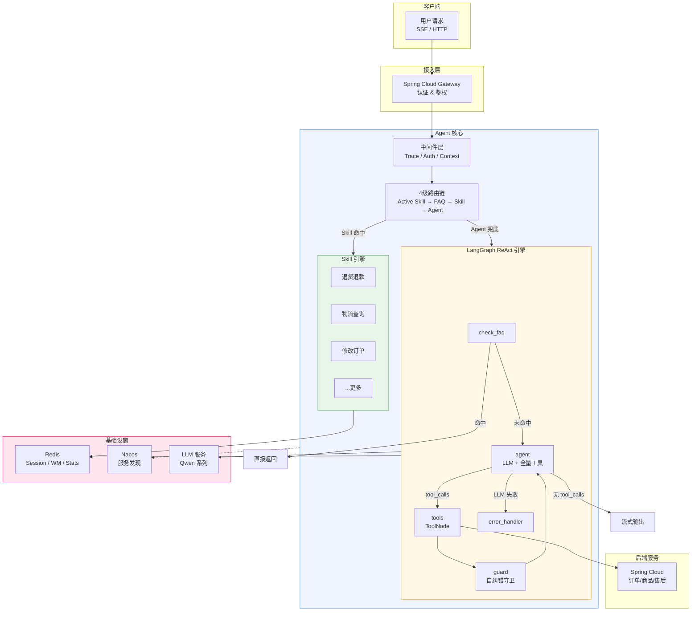
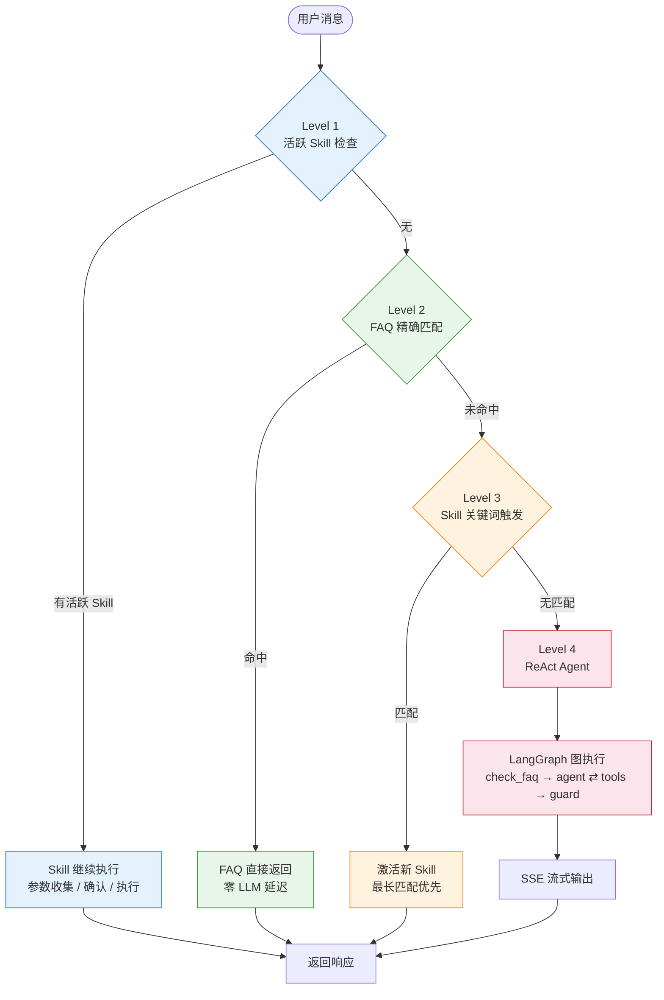

<p align="center">
  
  
  
  
  
</p>

<h1 align="center">AI 智能客服 Agent 系统</h1>

<p align="center">
  <b>Single Agent + Multi Skill</b> 混合路由架构 | 基于 LangGraph 的 ReAct 推理引擎 | 企业级容错与可观测体系
</p>

---

## 项目简介

基于 LangGraph + LangChain 构建的生产级 AI 智能客服系统。采用 **单 Agent + 多 Skill 混合路由** 架构，通过 4 级优先级路由链（Active Skill -> FAQ -> Skill Trigger -> ReAct Agent）实现精确意图分发；内置 8 个有状态 Skill、14 个业务工具、3 层记忆体系、Self-Correction 自纠错引擎、LLM 多级降级链及完整的安全防护与监控评估体系，面向电商客服场景提供全链路智能对话能力。

---

## 系统架构



---

## 路由决策流程



---

## 核心特性

### Agent 引擎

| 特性 | 说明 |
|------|------|
| **LangGraph 状态图** | `START -> check_faq -> agent -> tools -> guard -> agent` ReAct 循环，支持递归限制与错误兜底 |
| **4 级优先级路由** | Active Skill(会话连续) > FAQ(精确匹配) > Skill Trigger(关键词) > ReAct Agent(全量工具兜底) |
| **8 个有状态 Skill** | 退货退款 / 物流查询 / 修改订单 / 商品查询 / 取消退款 / 退款进度 / 投诉 / 转人工，状态机驱动(collecting -> confirming -> executing -> completed) |
| **14 个业务工具** | 装饰器栈 `@register_tool + @tool + @tool_result_cache + @resilient_tool`，统一容错与可观测 |

### 容错与韧性

| 特性 | 说明 |
|------|------|
| **LLM 多级降级链** | `qwen3-max -> qwen-plus -> qwen-turbo -> 静态兜底话术`，自动降级与恢复 |
| **熔断器** | `CLOSED -> OPEN -> HALF_OPEN` 状态机，5 次连续失败触发，30s 冷却，半开探测恢复 |
| **指数退避重试** | 最多 3 次重试 + Jitter 抖动，区分瞬态错误(5xx)与业务错误(4xx，不重试) |
| **TTL 结果缓存** | 查询类工具 60s 内存缓存，自动过期清理，命中率统计 |
| **Self-Correction** | 工具输出守卫: 压缩 -> 安全过滤 -> 错误模式检测(5 类信号) -> 纠错上下文注入 |

### 记忆体系

| 层级 | 存储 | TTL | 说明 |
|------|------|-----|------|
| **Session Memory** | Redis | 24h | 会话历史，读写时自动刷新 TTL |
| **Working Memory** | Redis | 1h | 任务状态机(gathering -> confirmation -> execution -> completed)，注入 System Prompt |
| **Conversation Summarizer** | Redis | 7d | LLM 异步后台总结，跨会话上下文延续 |

### 安全与成本

| 特性 | 说明 |
|------|------|
| **Prompt 注入检测** | 11 条正则模式，覆盖中英文常见攻击向量(忽略指令 / 角色扮演 / 越狱等) |
| **PII 脱敏** | 手机号(保留前3后4) / 身份证(保留前4后4) / 邮箱(保留首字母+域名) |
| **输出安全过滤** | SQL 异常栈 / IP / 凭证泄露检测，过度承诺词替换 |
| **Token 预算管理** | 100K/会话，三级渐进压缩: normal(保留20轮) -> warn(6轮) -> critical(3轮) |

### 可观测与评估

| 特性 | 说明 |
|------|------|
| **运营仪表盘** | 对话量 / FAQ 命中率 / 工具调用 / 情感分布 / 转接率 / 反馈统计 |
| **实时质量监控** | 每次请求自动采集 eval 数据(路由分布 / 延迟 / Token / 安全事件)到 Redis |
| **离线评估框架** | JSON 测试用例集，支持按领域/难度筛选，自动生成评估报告 |
| **链路追踪** | Trace ID 贯穿请求生命周期，structlog 结构化日志 |

---

## 技术栈

| 类别 | 技术 |
|------|------|
| **AI 框架** | LangGraph, LangChain, LangChain-OpenAI |
| **Web 框架** | FastAPI, Uvicorn, SSE Streaming |
| **LLM** | 通义千问 Qwen 系列 (OpenAI-compatible API) |
| **数据存储** | Redis 7 (Session / Working Memory / Stats / Cache) |
| **服务治理** | Nacos (服务发现 & 动态配置), Spring Cloud Gateway 集成 |
| **HTTP 客户端** | httpx (异步, 连接池) |
| **日志** | structlog (结构化日志 + Trace 关联) |
| **容器化** | Docker Compose (App + Redis + Nacos 一键部署) |
| **消息队列** | Pika / RabbitMQ (预留) |
| **测试** | pytest |

---

## 项目结构

```
ai-agent2/
├── main.py                    # FastAPI 应用入口 & 生命周期管理
├── config/
│   ├── settings.py            # Pydantic Settings 配置 (.env)
│   ├── schemas.py             # 请求/响应 Pydantic 模型
│   └── logging_config.py      # structlog 日志配置 & Trace ID
├── api/
│   ├── chat.py                # 核心对话 API (同步/SSE 流式)
│   ├── admin.py               # 管理端 API (仪表盘/转接/评估)
│   ├── feedback.py            # 用户反馈 API (点赞/踩)
│   ├── health.py              # 健康检查端点
│   └── dependencies.py        # FastAPI 依赖注入
├── agents/
│   ├── executor.py            # Agent 执行器 (4级路由入口)
│   ├── faq.py                 # FAQ 精确匹配 (问候语/功能介绍)
│   ├── summarizer.py          # 对话总结 (LLM 异步后台)
│   └── tools/
│       ├── registry.py        # @register_tool 自动注册表
│       ├── orders_tool.py     # 订单工具 (查询/取消)
│       ├── goods_tool.py      # 商品工具 (搜索)
│       ├── logistics_tool.py  # 物流工具 (查询/催促)
│       ├── coupon_tool.py     # 优惠券工具 (查询/领取)
│       ├── after_sale_tool.py # 售后工具 (退款/退货/换货)
│       └── transfer_tool.py   # 转人工工具
├── graph/
│   ├── state.py               # AgentState 定义 (TypedDict)
│   ├── nodes.py               # 节点函数 (check_faq/agent/guard/error)
│   └── graph.py               # LangGraph 图组装 & 编译
├── skills/
│   ├── base.py                # Skill 基类 (状态机/参数定义/提取策略)
│   ├── manager.py             # SkillManager (Redis 状态持久化)
│   ├── trigger.py             # 触发检测 (活跃检查/关键词匹配)
│   ├── return_item_skill.py   # 退货退款 Skill
│   ├── track_order_skill.py   # 物流查询 Skill
│   ├── modify_order_skill.py  # 修改订单 Skill
│   ├── product_query_skill.py # 商品查询 Skill
│   ├── cancel_refund_skill.py # 取消退款 Skill
│   ├── refund_status_skill.py # 退款进度 Skill
│   ├── complaint_skill.py     # 投诉 Skill
│   └── transfer_to_human_skill.py # 转人工 Skill
├── memory/
│   ├── session_memory.py      # Session Memory (Redis, 24h TTL)
│   └── working_memory.py      # Working Memory (任务状态机, 1h TTL)
├── reasoning/
│   ├── self_correction.py     # Self-Correction 自纠错引擎
│   ├── compressor.py          # 工具输出压缩
│   └── prompts/
│       ├── loader.py          # YAML Prompt 模板加载器
│       ├── domain_prompts.py  # 领域 Prompt 定义
│       └── yaml/              # Prompt 模板 (base/order/product/after_sale/coupon)
│       └── policies/          # 策略 Prompt (退货/物流/服务)
├── resilience/
│   ├── llm_factory.py         # LLM 工厂 & 多级降级链
│   ├── circuit_breaker.py     # 熔断器 (状态机 + 全局注册表)
│   └── decorators.py          # @resilient_tool (熔断+重试+日志)
├── cost/
│   ├── token_budget.py        # Token 预算管理 (渐进压缩)
│   └── cache.py               # 工具结果 TTL 缓存
├── core/
│   ├── security.py            # 安全防护 (注入检测/PII/输出过滤)
│   ├── execution.py           # 图执行 (流式输出 + Token 记录)
│   ├── context.py             # 上下文构建 (摘要/情感/WM/Budget)
│   ├── sentiment.py           # 情感分析
│   └── dialog_tracker.py      # 对话进度追踪
├── middleware/
│   ├── trace.py               # Trace ID & 指标中间件
│   ├── auth.py                # 用户认证 (Token/Header)
│   └── context.py             # 请求上下文管理 (ContextVar)
├── monitoring/
│   ├── dashboard.py           # 运营统计 (Redis 计数 + 聚合)
│   ├── realtime.py            # 实时质量监控 (eval 数据采集)
│   └── eval/
│       ├── runner.py          # 离线评估执行器
│       ├── evaluator.py       # 评估指标计算
│       ├── test_cases.json    # 测试用例集
│       └── eval_report.json   # 评估报告输出
├── services/
│   ├── http_client.py         # httpx 异步 HTTP 客户端
│   ├── redis_client.py        # Redis 连接管理
│   ├── nacos_client.py        # Nacos 服务注册 & 配置监听
│   └── auth.py                # 认证服务 (Gateway 调用)
├── tests/                     # pytest 测试用例
├── docker-compose.yml         # 一键部署 (App + Redis + Nacos)
├── Dockerfile
├── requirements.txt
└── .env.example               # 环境变量模板
```

---

## 快速开始

### 前置条件

- Python 3.14+
- Redis 7+
- Nacos 2.3+ (可选，服务发现)
- 通义千问 API Key ([DashScope](https://dashscope.console.aliyun.com/))

### 1. 克隆 & 安装

```bash
git clone https://github.com/your-username/ai-agent2.git
cd ai-agent2
python -m venv .venv
source .venv/bin/activate  # Windows: .venv\Scripts\activate
pip install -r requirements.txt
```

### 2. 环境配置

```bash
cp .env.example .env
```

编辑 `.env`，填入必要配置：

```env
# LLM (必填)
OPENAI_API_KEY=your-dashscope-api-key
OPENAI_BASE_URL=https://dashscope.aliyuncs.com/compatible-mode/v1
OPENAI_MODEL=qwen3-max

# Redis
REDIS_HOST=127.0.0.1
REDIS_PORT=6379

# Agent Server
AGENT_HOST=0.0.0.0
AGENT_PORT=8000

# Spring Cloud Gateway (业务后端)
SPRING_GATEWAY_URL=http://localhost:9000

# Nacos (可选)
NACOS_SERVER=127.0.0.1:8848
```

### 3. 启动服务

**本地开发:**

```bash
python main.py
```

**Docker Compose (推荐):**

```bash
docker compose up -d
```

> 将自动启动 AI Agent + Redis + Nacos 三个服务。

### 4. 验证

```bash
# 健康检查
curl http://localhost:8000/health

# 发送消息 (需认证)
curl -X POST http://localhost:8000/chat \
  -H "Content-Type: application/json" \
  -H "X-User-Id: 1" \
  -d '{"message": "你好"}'
```

---

## API 接口

### 对话接口

| 方法 | 路径 | 说明 |
|------|------|------|
| `POST` | `/chat` | 同步对话 (返回完整响应 + eval 元数据) |
| `POST` | `/chat/stream` | SSE 流式对话 (逐 token 推送) |
| `GET` | `/chat/history/{session_id}` | 获取会话历史 |
| `DELETE` | `/chat/clear/{session_id}` | 清除会话 |
| `POST` | `/chat/feedback` | 用户反馈 (点赞/踩) |
| `GET` | `/chat/feedback/stats` | 反馈统计 |

### 管理接口

| 方法 | 路径 | 说明 |
|------|------|------|
| `GET` | `/admin/dashboard` | 运营监控面板 (对话量/工具/熔断器/预算) |
| `GET` | `/admin/transfer/pending` | 待处理转接队列 |
| `GET` | `/admin/transfer/{id}` | 转接工单详情 + 聊天记录 |
| `POST` | `/admin/transfer/{id}/accept` | 接听转接 |
| `POST` | `/admin/transfer/{id}/reply` | 人工回复用户 |
| `POST` | `/admin/transfer/{id}/complete` | 完成转接 |
| `POST` | `/admin/eval/run` | 触发离线评估 (支持领域/难度筛选) |
| `GET` | `/admin/eval/report` | 获取最新评估报告 |
| `GET` | `/admin/eval/realtime` | 实时质量监控数据 |
| `GET` | `/admin/eval/traces` | 请求链路明细 |
| `GET` | `/health` | 服务健康检查 |

---

## 监控与评估

系统内置 **3 层可观测体系**，覆盖从实时运营到离线评估的完整链路：

**Layer 1 - 运营仪表盘** (`/admin/dashboard`)
- 每日对话量 / FAQ 命中率 / 工具调用分布 / 情感分布 / 转接率
- 熔断器状态 (CLOSED/OPEN/HALF_OPEN)
- Token 预算消耗 (normal/warn/critical)
- 工具缓存命中率

**Layer 2 - 实时质量监控** (`/admin/eval/realtime`)
- 每次 `/chat` 请求自动采集 eval 数据到 Redis
- 路由来源分布 (active_skill / faq / skill / react_agent)
- 延迟分位数 / Token 消耗 / 安全事件统计
- 请求链路追踪 (`/admin/eval/traces`)

**Layer 3 - 离线评估框架** (`/admin/eval/run`)
- JSON 格式测试用例集，支持按领域 (order/product/after_sale/coupon/safety/faq) 和难度 (easy/medium/hard) 筛选
- 自动执行并生成评估报告，包含路由准确率、工具调用正确率、响应质量评分

---

## 设计亮点

**为什么选择单 Agent + Multi Skill 而非多 Agent?**
> 多 Agent 架构引入路由 LLM 开销（额外 1-2s 延迟 + Token 成本），且在客服场景中领域边界模糊（"退货"同时涉及订单和售后）。单 Agent 绑定全量工具，由 LLM 自主决策工具组合，配合 Skill 状态机处理确定性流程，兼顾灵活性与确定性。

**Self-Correction vs 简单重试**
> 重试是"同样的调用再试一次"，Self-Correction 是"换一种方式再试"。Guard 节点在工具执行后检测 5 类错误信号（认证异常/未找到/操作失败/资源不足/空结果），注入纠错上下文强制 LLM 调整策略，最多纠错 1 次避免无限循环。

**Working Memory 的价值**
> 传统方式靠 LLM 从聊天历史中"回忆"任务进度，容易遗漏。Working Memory 将任务状态显式化为状态机（gathering -> confirmation -> execution -> completed），从工具调用参数中自动提取已收集信息，注入 System Prompt 让 LLM 始终知道当前进度。

---

## License

[MIT](LICENSE)
